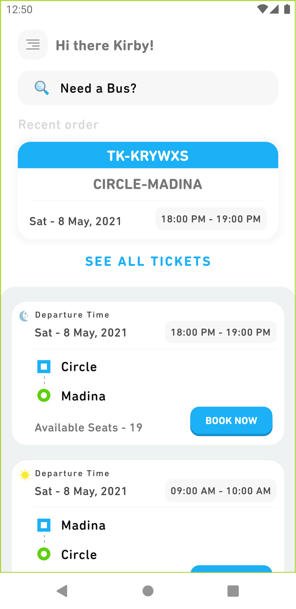
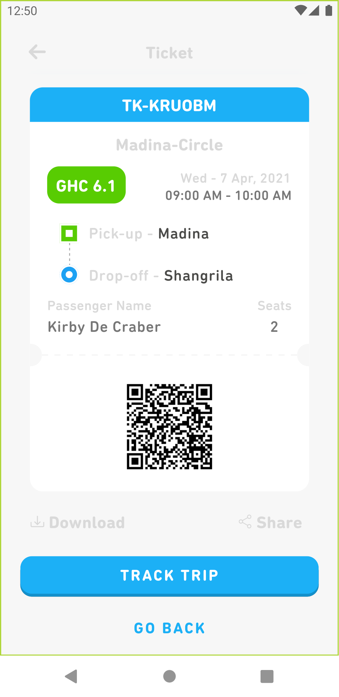
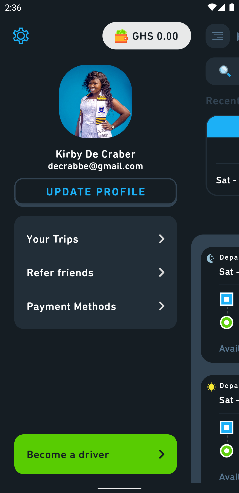
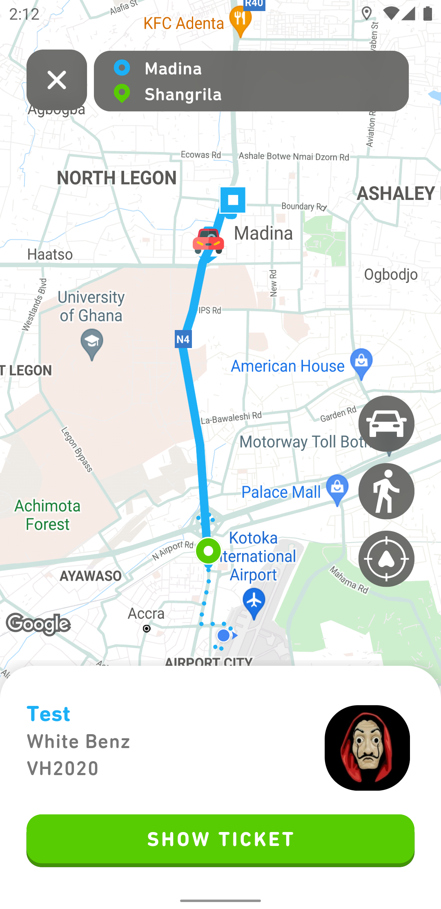
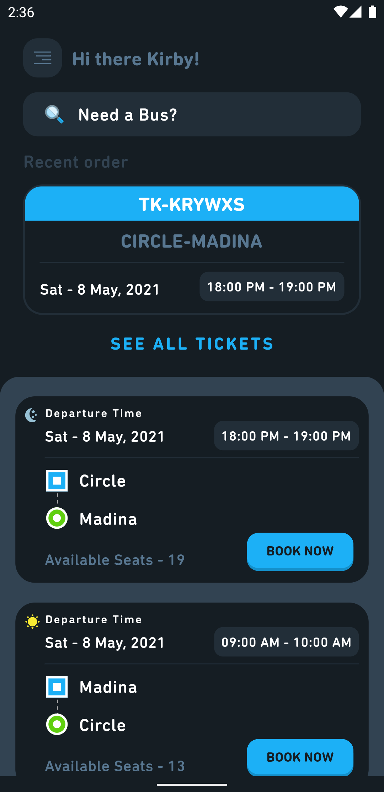

# Vielly User Mobile

Welcome to the Vielly User Mobile, a feature-rich mobile app built with Flutter. This application simplifies bus ticket booking and ride-hailing services while leveraging the power of Flutter, MVVM architecture, and Firebase services. Here, we provide an overview of the app and how to get started.

## Table of Contents

- [Vielly User Mobile](#vielly-user-mobile)
  - [Table of Contents](#table-of-contents)
  - [Features](#features)
  - [Screenshots](#screenshots)
  - [Prerequisites](#prerequisites)
  - [Installation](#installation)
  - [Usage](#usage)
  - [App Architecture](#app-architecture)
  - [Firebase Integration](#firebase-integration)
  - [License](#license)

## Features

- **Bus Ticket Booking**: Users can search for available buses, select routes, and book tickets seamlessly.

- **Ride-Hailing Services**: The app provides ride-hailing services, allowing users to book rides and travel conveniently.

- **Real-time Data**: Leveraging Firebase Firestore and real-time database, the app keeps users updated with the latest information.

- **Storage**: Firebase Storage is integrated for storing user-related data and media files.

- **Authentication**: Firebase Authentication ensures secure user authentication and authorization.

- **Google Maps**: Google Maps integration allows users to view bus routes, destinations, and ride-hail vehicles in real-time.

## Screenshots
| Home Screen       | Ticket Screen       | Side Navigation Menu       |
|-------------------------------|-------------------------------|-------------------------------|
|  |  |  |
| Ride View       | Ride Order Screen        | Dark Mode       |
|  |  |  |


## Prerequisites

Before diving into the Bus Ticketing and Ride-Hailing App, make sure you have the following prerequisites:

- [Flutter](https://flutter.dev/docs/get-started/install): Install the Flutter SDK for mobile app development.
- [Firebase Account](https://firebase.google.com/): Create a Firebase project and set up the required services (Firestore, Authentication, Storage) as mentioned in the Firebase Integration section.

## Installation

1. Clone this repository:

   ```bash
   git clone https://github.com/kingsleyocran/vielly-mobile.git
   cd vielly-mobile
   ```

2. Install Flutter dependencies:

   ```bash
   flutter pub get
   ```

3. Run the app on your preferred emulator or physical device:

   ```bash
   flutter run
   ```

## Usage

1. Open the Bus Ticketing and Ride-Hailing App on your emulator or device.

2. Explore the app's features, including bus ticket booking and ride-hailing services.

3. Sign in or create an account to access personalized features.

4. Use Google Maps integration to navigate routes, destinations, and view real-time ride-hail vehicles.

## App Architecture

The Bus Ticketing and Ride-Hailing App follows the MVVM (Model-View-ViewModel) architectural pattern, leveraging the Stacked package for state management and separation of concerns. This architecture ensures a structured and maintainable codebase.

## Firebase Integration

The app integrates with various Firebase services, including Firestore, real-time database, storage, authentication, and Google Maps. Firebase provides a robust backend infrastructure, allowing real-time data updates and secure user management. To set up Firebase for this app, refer to the Firebase documentation and configure the necessary services.

## License

This Bus Ticketing and Ride-Hailing App is open-source software released under the [MIT License](LICENSE).